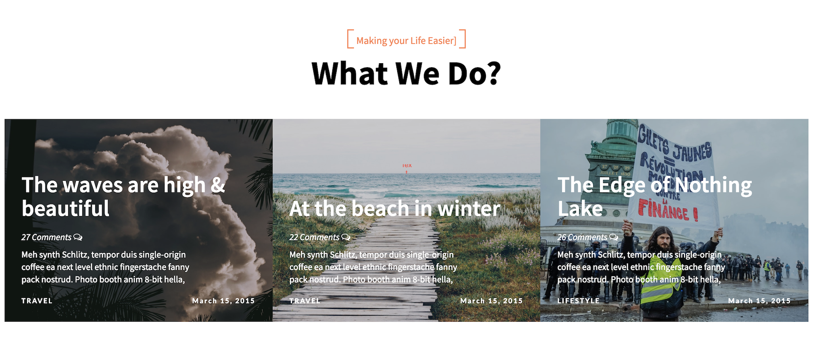
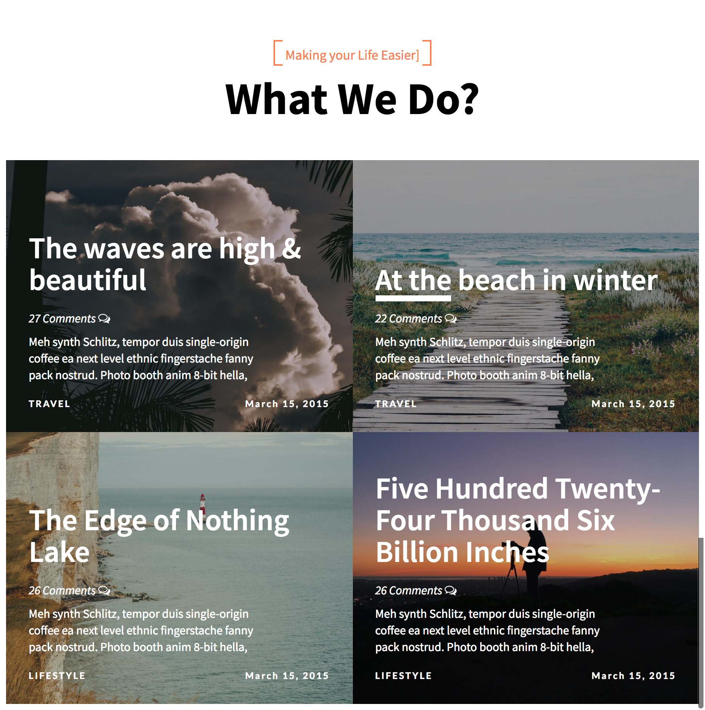
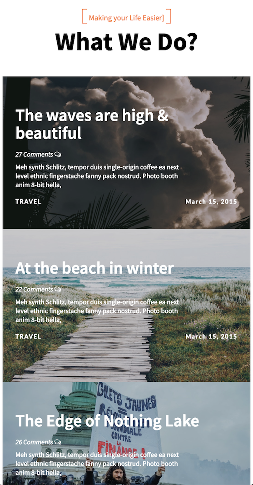

# Activity 3: Responsive Design - Flexbox

- Reuse the code generated in [Activity 2](../Activity2-ResponsiveDesign-CSS)

- Make the site responsive, considering the following:
  - Card content should be centered horizontally and vertically using Flexbox.
  - Page should display three cards for desktop view (1200px), two cards for tablet view (768px), and one card for mobile view (425px) .
  - When a single card is displayed in a row, it should be displayed with the 100% width.

#### Desktop expected:

#### Tablet expected:

#### Mobile expected:
